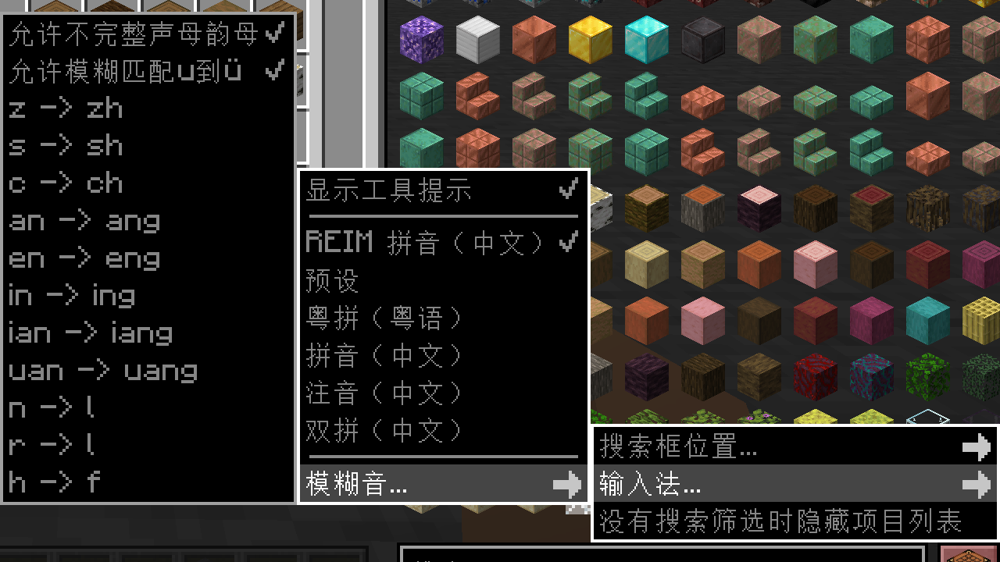

# RoughlyEnoughInputMethods
Add a better pinyin input method for REI.

A mod for https://github.com/shedaniel/RoughlyEnoughItems/issues/1440.

## Supported REI Versions
- \>= 9.1.580 and < 10
- \>= 10.0.581